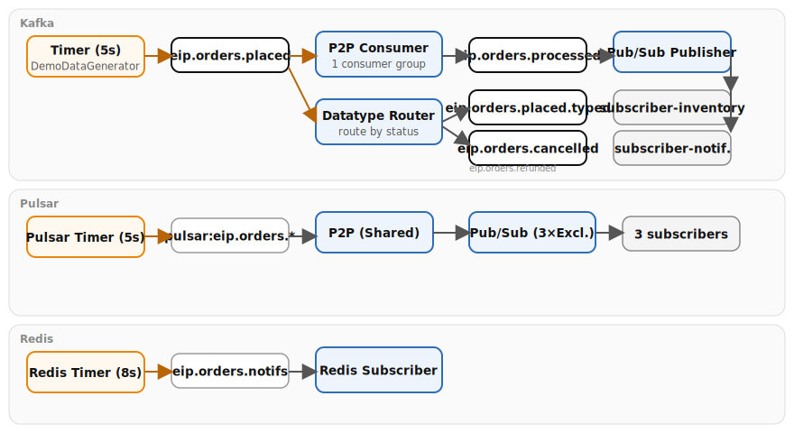

# Chapter 4: Channel Types

Demonstrates six messaging channel patterns with Apache Camel, showing the same Point-to-Point and Publish-Subscribe concepts implemented across Kafka, Pulsar, and Redis. Both **Quarkus** and **Spring Boot** runtimes are provided — the Camel route logic is identical; only class annotations and configuration differ.

- **Point-to-Point Channel** — a single consumer group (`p2p-order-processor`) ensures each order is processed by exactly one consumer
- **Publish-Subscribe Channel** — three independent consumer groups (`subscriber-inventory`, `subscriber-notification`, `subscriber-analytics`) on the same topic, each receives every message
- **Datatype Channel** — routes inbound orders by `status` field to dedicated type-specific topics (`placed`, `cancelled`, `refunded`)
- **Pulsar P2P** — `Shared` subscription distributes messages round-robin across consumers
- **Pulsar Pub/Sub** — three `Exclusive` subscriptions each receive every message independently
- **Redis Pub/Sub** — fire-and-forget real-time notifications with no persistence or durability

## Running

```bash
# Start the full infrastructure stack (Kafka + Pulsar + Redis required)
./scripts/setup-stack.sh

# Quarkus
cd examples/04-channel-types/quarkus
mvn quarkus:dev

# Spring Boot
cd examples/04-channel-types/spring-boot
mvn spring-boot:run

# YAML DSL (Camel CLI — no Maven required)
cd examples/04-channel-types/yaml-dsl
camel run *
```

> **Note:** The YAML DSL variant includes only the declarative EIP routes. Data generators and Java-specific patterns (custom aggregation strategies, CDI beans) remain in the Quarkus and Spring Boot variants.

## Infrastructure

Requires Kafka, Pulsar, and Redis from the Podman stack.

## Data flow



## What to observe

1. **Demo data generators** producing orders every 5 seconds to both Kafka and Pulsar
2. **Point-to-Point** — each order consumed once and forwarded to `eip.orders.processed` (Kafka) and logged (Pulsar)
3. **Pub/Sub fan-out** — the same order event logged by all three subscribers on both Kafka and Pulsar
4. **Redis Pub/Sub** — shipping notifications published to Redis every 8 seconds, received by the subscriber in real-time
5. **Datatype routing** — orders sorted into type-specific topics by status field

Open Kafka UI at [http://localhost:8090](http://localhost:8090) to inspect topics and consumer groups.

## Kafka topics

| Topic | Pattern | Description |
|-------|---------|-------------|
| `eip.orders.placed` | Inbound | Incoming orders from the demo generator |
| `eip.orders.processed` | P2P | Successfully processed orders |
| `eip.orders.events` | Pub/Sub | Shared event topic for fan-out |
| `eip.orders.placed.typed` | Datatype | Orders with status `placed` |
| `eip.orders.cancelled` | Datatype | Orders with status `cancelled` |
| `eip.orders.refunded` | Datatype | Orders with status `refunded` |
| `eip.orders.unknown` | Datatype | Orders with unrecognized status |

## Pulsar topics

| Topic | Pattern | Description |
|-------|---------|-------------|
| `persistent://public/default/eip.orders.placed` | P2P | Shared subscription |
| `persistent://public/default/eip.orders.events` | Pub/Sub | 3 Exclusive subscriptions |

## Redis

| Channel | Description |
|---------|-------------|
| `eip.orders.notifications` | Fire-and-forget Pub/Sub notifications |

---

*Verification status: Quarkus variant verified against Quarkus 3.37.0, Camel 4.20.0 on Podman (2026-07-11). Spring Boot variant compiles against Spring Boot 4.0.7, Camel 4.20.0.*
