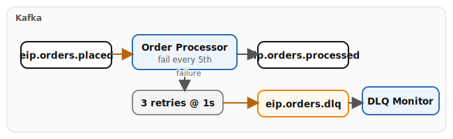

# Chapter 5: Channel Reliability

Demonstrates error handling and guaranteed delivery with Apache Camel on Quarkus:

- **Dead Letter Channel** — failed orders retry 3 times at 1-second intervals then route to `eip.orders.dlq`; a DLQ monitor route logs each failure with the exception reason
- **Guaranteed Delivery** — Kafka producer `acks=all` ensures messages survive broker failures

## Running

```bash
# Start the infrastructure stack (Kafka required)
./scripts/setup-stack.sh

cd examples/05-reliability
mvn quarkus:dev
```

This example has no demo data generator — it relies on messages on `eip.orders.placed` from other examples (e.g., Chapter 4) or external producers.

## Infrastructure

Requires Kafka from the Podman stack.

## Data flow



## What to observe

1. Orders consumed from `eip.orders.placed`
2. Most orders processed successfully and forwarded to `eip.orders.processed`
3. Every 5th order (`orderId % 5 == 0`) fails, retries 3 times, then lands in `eip.orders.dlq`
4. The DLQ monitor logs each failed message with the exception reason

Open Kafka UI at [http://localhost:8090](http://localhost:8090) to inspect the `eip.orders.dlq` topic.

## Kafka topics

| Topic | Description |
|-------|-------------|
| `eip.orders.placed` | Incoming orders (input) |
| `eip.orders.processed` | Successfully processed orders |
| `eip.orders.dlq` | Dead letter queue for failed orders |

---

*Verification status: unverified.*
