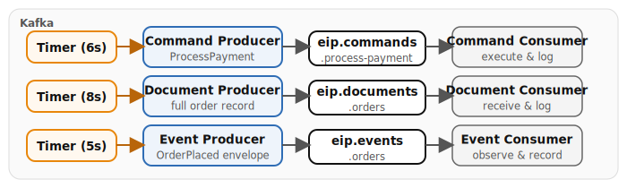

# Chapter 7: Message Types

Demonstrates the three fundamental message types defined by Hohpe and Woolf, implemented with Apache Camel. Both **Quarkus** and **Spring Boot** runtimes are provided — the Camel route logic is identical; only class annotations and configuration differ. Three independent timer-driven routes produce and consume Command, Document, and Event messages through Kafka, showing how each type implies a different contract between sender and receiver.

- **Command Message** -- a "do something" directive (`ProcessPayment`) sent point-to-point; the consumer executes the command and produces a result with status `PROCESSED`.
- **Document Message** -- a "here is the data" transfer carrying a complete order record with everything the receiver needs; the consumer receives the document with no implied action.
- **Event Message** -- a "something happened" notification (`OrderPlaced`) wrapped in an event envelope with metadata (`event_id`, `event_time`, `source`); the consumer logs the event with no return value.

## Running

```bash
# Start the full infrastructure stack
./scripts/setup-stack.sh

# Quarkus
cd examples/07-message-types/quarkus
mvn quarkus:dev

# Spring Boot
cd examples/07-message-types/spring-boot
mvn spring-boot:run

# YAML DSL (Camel CLI — no Maven required)
cd examples/07-message-types/yaml-dsl
camel run *
```

> **Note:** The YAML DSL variant includes only the declarative EIP routes. Data generators and Java-specific patterns (custom aggregation strategies, CDI beans) remain in the Quarkus and Spring Boot variants.

## Infrastructure

- **Kafka (KRaft)** -- all three message types are produced to and consumed from Kafka topics.

## Data flow



## What to observe

1. **Command messages** (every 6s) -- look for JSON payloads with `command: "ProcessPayment"` containing `payment_id`, `order_id`, `customer_id`, `amount`, `currency`, and `payment_method`. The consumer logs execution and a `PROCESSED` status result.
2. **Document messages** (every 8s) -- look for full order records with an `items` array and `shipping_address` block. The consumer logs the received contents without performing any action.
3. **Event messages** (every 5s) -- look for event envelopes with `event_type: "OrderPlaced"`, a UUID `event_id`, ISO `event_time`, `source`, and a nested `data` block. The consumer records the event with no reply.
4. **Contrast the three** -- commands produce a result, documents carry data passively, and events notify without expecting anything back.

## How to test

There are no REST endpoints. All three routes are timer-driven and begin producing messages automatically when the application starts. Open Kafka UI at [http://localhost:8090](http://localhost:8090) to inspect messages on each topic, or watch the Quarkus console log on [http://localhost:8082](http://localhost:8082).

## Kafka topics

| Topic | Description |
|-------|-------------|
| `eip.commands.process-payment` | Point-to-point payment commands |
| `eip.documents.orders` | Full order data records |
| `eip.events.orders` | Order lifecycle event notifications |

---

*Verification status: Quarkus variant verified against Quarkus 3.37.0, Camel 4.20.0 on Podman (2026-07-11). Spring Boot variant compiles against Spring Boot 4.0.7, Camel 4.20.0.*
