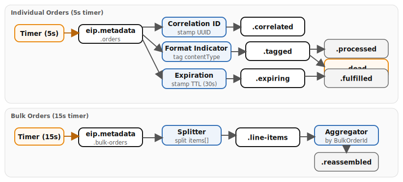

# Chapter 8: Message Metadata

Demonstrates four message metadata patterns with Apache Camel. Both **Quarkus** and **Spring Boot** runtimes are provided — the Camel route logic is identical; only class annotations and configuration differ. Two timer-driven generators feed orders into Kafka, where downstream routes stamp, inspect, split, aggregate, and expire messages based on header metadata -- showing how metadata travels with the message body and drives routing decisions.

- **Correlation Identifier** -- stamps a UUID `X-Correlation-ID` header that travels through validate, enrich, and output stages, enabling end-to-end request tracking.
- **Message Sequence** -- splits a bulk order into individual line items carrying `CamelSplitIndex` and `CamelSplitSize` headers, then aggregates them back by `BulkOrderId`.
- **Message Expiration** -- stamps `messageCreatedAt` and `messageExpiresAt` (30-second TTL); the consumer drops expired messages to a dead topic.
- **Format Indicator** -- tags messages with `contentType` and `schemaVersion` headers; the consumer dispatches by format (JSON/XML/unknown to dead).

## Running

```bash
# Start the full infrastructure stack
./scripts/setup-stack.sh

# Quarkus
cd examples/08-message-metadata/quarkus
mvn quarkus:dev

# Spring Boot
cd examples/08-message-metadata/spring-boot
mvn spring-boot:run
```

## Infrastructure

- **Kafka (KRaft)** -- all metadata patterns produce to and consume from Kafka topics.

## Data flow



## What to observe

1. **Correlation ID** -- messages on `eip.metadata.orders.correlated` carry the `X-Correlation-ID` header through all three stages (validate, enrich, output).
2. **Message Sequence** -- `eip.metadata.line-items` messages have `CamelSplitIndex` and `CamelSplitSize` headers; `eip.metadata.orders.reassembled` contains the aggregated result grouped by `BulkOrderId`.
3. **Message Expiration** -- orders processed within 30 seconds land on `eip.metadata.orders.fulfilled`; expired ones are routed to `eip.metadata.orders.dead`.
4. **Format Indicator** -- `eip.metadata.orders.tagged` messages carry `contentType` and `schemaVersion` headers; JSON-format messages proceed to `processed`, unknown formats go to `dead`.

## How to test

There are no REST endpoints. Both timers start automatically. Open Kafka UI at [http://localhost:8090](http://localhost:8090) to inspect message headers on each topic. Check the `X-Correlation-ID`, `CamelSplitIndex`, `messageExpiresAt`, and `contentType` headers directly in the Kafka UI message detail view.

## Kafka topics

| Topic | Description |
|-------|-------------|
| `eip.metadata.orders` | Incoming orders (generated by demo) |
| `eip.metadata.orders.correlated` | Orders with correlation IDs attached |
| `eip.metadata.bulk-orders` | Bulk orders for sequence demo |
| `eip.metadata.line-items` | Individual line items (split from bulk) |
| `eip.metadata.orders.reassembled` | Aggregated line items |
| `eip.metadata.orders.expiring` | Orders with expiration timestamps |
| `eip.metadata.orders.fulfilled` | Non-expired orders processed |
| `eip.metadata.orders.tagged` | Orders tagged with format indicator |
| `eip.metadata.orders.processed` | Orders processed after format detection |
| `eip.metadata.orders.dead` | Expired or unknown-format messages |

---

*Verification status: Quarkus variant verified against Quarkus 3.37.0, Camel 4.20.0 on Podman (2026-07-11). Spring Boot variant compiles against Spring Boot 4.0.7, Camel 4.20.0.*
