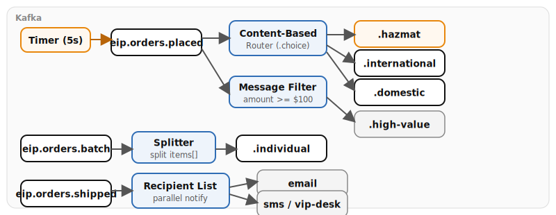

# Chapter 9: Routing Fundamentals

Demonstrates four core routing patterns with Apache Camel on Quarkus. A timer-driven generator publishes orders to Kafka every five seconds, cycling through destination countries and occasionally flagging hazardous materials. Downstream routes show how Camel's fluent Java DSL routes, filters, splits, and fans out messages based on content.

- **Content-Based Router** -- routes orders by `contains_hazmat` flag and `destination_country` using `.choice()` to hazmat, international, or domestic topics.
- **Message Filter** -- filters to keep only high-value orders (amount >= $100) using `.filter()`.
- **Splitter** -- splits a batch order containing an `items[]` array into individual order messages via `.split(jsonpath("$.items[*]"))`.
- **Recipient List** -- dynamically builds a notification channel list (email always, SMS if phone present, VIP desk if amount >= $500) using `.recipientList()` with parallel processing.

## Running

```bash
# From repository root
./scripts/setup-stack.sh

cd examples/09-routing-fundamentals
mvn quarkus:dev
```

## Infrastructure

- **Kafka (KRaft)** -- all routing patterns produce to and consume from Kafka topics.

## Data flow



## What to observe

1. **Content-Based Router** -- watch orders route to `eip.orders.hazmat` (every 7th order), `eip.orders.international` (CA/GB/DE/JP), or `eip.orders.domestic` (US) based on the order content.
2. **Message Filter** -- only orders with `amount >= 100` appear on `eip.orders.high-value`; lower-value orders are silently dropped.
3. **Splitter** -- bulk orders from `eip.orders.batch` are split into individual items on `eip.orders.individual`, each carrying the original item data.
4. **Recipient List** -- shipped orders fan out to `notify-email` (always), `notify-sms` (conditionally), and `notify-vip-desk` (for high-value orders >= $500). Check the log for which channels are selected per order.

## How to test

There are no REST endpoints. The demo data generator starts automatically and produces orders every 5 seconds with cycling `destination_country` values (US, CA, GB, DE, JP) and a `contains_hazmat` flag on every 7th order. Open Kafka UI at [http://localhost:8090](http://localhost:8090) to watch messages arrive on the different output topics based on order content.

## Kafka topics

| Topic | Description |
|-------|-------------|
| `eip.orders.placed` | All incoming orders (generated by demo) |
| `eip.orders.domestic` | US domestic orders |
| `eip.orders.international` | International orders |
| `eip.orders.hazmat` | Hazardous materials orders |
| `eip.orders.high-value` | Orders >= $100 (filtered) |
| `eip.orders.batch` | Batch orders for splitter demo |
| `eip.orders.individual` | Individual items from split batches |
| `eip.orders.shipped` | Shipped orders for recipient list demo |

---

*Verification status: verified against Quarkus 3.36.3, Camel 4.20.0 on Podman (2026-07-11).*
