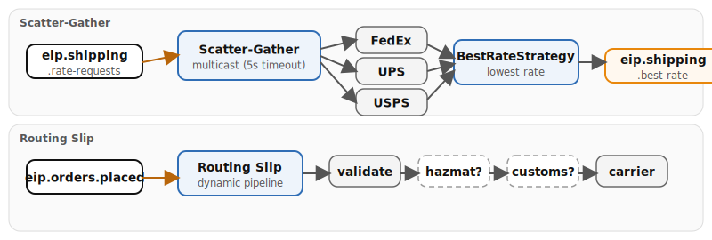

# Chapter 10: Composed Routing

Demonstrates how individual routing patterns compose into larger message flows, combining scatter-gather for parallel rate comparison with routing slips for dynamic sequential processing.

- **Scatter-Gather** — multicasts shipping rate requests to FedEx, UPS, USPS in parallel with a 5s timeout; BestRateStrategy aggregation selects the lowest rate
- **Routing Slip** — dynamically constructs a comma-separated processing pipeline based on order properties, then executes via `.routingSlip(header("orderSlip"))`

## Running

```bash
# From repo root — start the infrastructure stack
./scripts/setup-stack.sh

# Run the example
cd examples/10-composed-routing && mvn quarkus:dev
```

## Infrastructure

Requires Kafka from the Podman stack.

## Data flow



## What to observe

1. Rate requests arriving on `eip.shipping.rate-requests` and being multicast to three carrier quote routes (`quote-fedex`, `quote-ups`, `quote-usps`)
2. Each carrier simulating pricing with weight-based formulas and returning a quote
3. `BestRateStrategy` aggregation selecting the lowest rate after all three respond (or 5s timeout)
4. Best rate result published to `eip.shipping.best-rate`
5. Orders on `eip.orders.placed` triggering the routing slip with a dynamically constructed `orderSlip` header
6. Conditional steps (`hazmat-compliance`, `customs-classification`) appearing in the slip only when order properties require them
7. Final `assign-carrier` step completing the routing slip pipeline

## How to test

Produce a rate request to `eip.shipping.rate-requests` via Kafka UI at [localhost:8090](http://localhost:8090):

```json
{"order_id": 1, "weight_kg": 5.0, "destination_country": "US"}
```

Watch the best rate result appear on `eip.shipping.best-rate`.

## Kafka topics

| Topic | Description |
|-------|-------------|
| `eip.shipping.rate-requests` | Incoming rate requests for scatter-gather |
| `eip.shipping.best-rate` | Best carrier rate result after aggregation |
| `eip.orders.placed` | Incoming orders for routing slip |

---
*Verification status: verified against Quarkus 3.36.3, Camel 4.20.0 on Podman (2026-07-11).*
