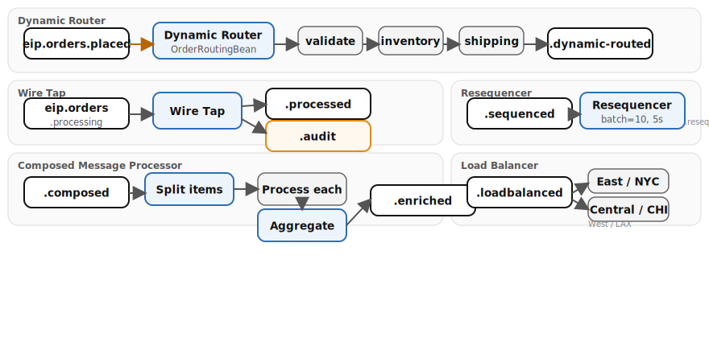

# Chapter 11: Advanced Routing

Explores five advanced routing patterns with built-in demo data generators that produce a continuous stream of test messages across all routes.

- **Dynamic Router** — routes messages through a sequence of processing steps determined at runtime by a control bean that returns the next destination or null to stop
- **Wire Tap** — sends a copy of each message to an audit channel without disrupting the main flow
- **Resequencer** — collects out-of-order messages and re-emits them in correct sequence number order
- **Composed Message Processor** — splits a message into parts, processes each independently, then re-aggregates the results
- **Load Balancer** — distributes messages across multiple endpoints using a round-robin strategy

## Running

```bash
# From repo root — start the infrastructure stack
./scripts/setup-stack.sh

# Run the example
cd examples/11-advanced-routing && mvn quarkus:dev
```

## Infrastructure

Requires Kafka from the Podman stack.

## Data flow



## What to observe

1. Demo data generators producing messages on four separate timers (5s, 3s, 8s, 2s)
2. Dynamic router stepping orders through validate, inventory, shipping via `OrderRoutingBean`, returning null to stop
3. Wire tap copying messages to `eip.orders.audit` with `audit_timestamp` and `audit_source` headers without blocking the main flow
4. Resequencer collecting 10 out-of-order messages (or waiting 5s), then emitting them sorted by `sequenceNumber` header
5. Composed message processor splitting multi-item orders, processing each line item in parallel (validate, calculate `line_total`, mark `in_stock`), then re-aggregating with `order_total`
6. Load balancer distributing orders round-robin across three fulfillment centers (East/NYC, Central/CHI, West/LAX)

## Kafka topics

| Topic | Description |
|-------|-------------|
| `eip.orders.placed` | Incoming orders for dynamic router |
| `eip.orders.dynamic-routed` | Orders after dynamic routing |
| `eip.orders.processing` | Orders entering wire-tap main flow |
| `eip.orders.processed` | Orders after wire-tap processing |
| `eip.orders.audit` | Audit copies from wire tap |
| `eip.orders.sequenced` | Out-of-order messages for resequencer |
| `eip.orders.resequenced` | Messages after resequencing |
| `eip.orders.composed` | Orders with line items for composed processing |
| `eip.orders.enriched` | Enriched orders after composed processing |
| `eip.orders.loadbalanced` | Orders entering load balancer |

---
*Verification status: unverified.*
