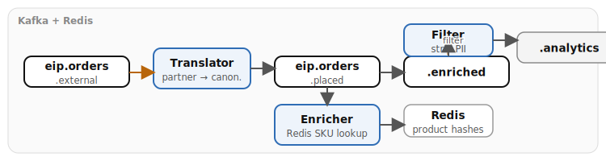

# Chapter 12: Transformation

Demonstrates the three core transformation patterns as a connected pipeline: translate external formats to canonical, enrich with product data from Redis, then filter sensitive fields for analytics. Both **Quarkus** and **Spring Boot** runtimes are provided — the Camel route logic is identical; only class annotations, DI annotations, and Redis client configuration differ.

- **Message Translator** — converts external partner order format (`orderNumber`/`clientRef`/`productCode`) to canonical internal format (`order_id`/`customer_id`/`item_sku`)
- **Content Enricher** — uses `.enrich("direct:redis-product-lookup", strategy)` to look up product details from Redis by SKU and merge `product_name`, `category`, `weight_kg`, `shipping_zone` into the order
- **Content Filter** — strips PII fields, keeping only an allowlist (`order_id`, `item_sku`, `quantity`, `amount`, `destination_country`, `shipping_priority`, `status`) for analytics

## Running

```bash
# From repo root — start the infrastructure stack
./scripts/setup-stack.sh

# Quarkus
cd examples/12-transformation/quarkus
mvn quarkus:dev

# Spring Boot
cd examples/12-transformation/spring-boot
mvn spring-boot:run
```

## Infrastructure

Requires Kafka and Redis from the Podman stack. On startup, the `RedisProductCatalog` bean seeds product data into Redis hashes (Quarkus uses CDI `@Startup`; Spring Boot uses `@PostConstruct`).

## Data flow



## What to observe

1. External-format orders arriving on `eip.orders.external` with partner field names (`orderNumber`, `clientRef`, `productCode`)
2. Message translator converting to canonical format (`order_id`, `customer_id`, `item_sku`) and publishing to `eip.orders.placed`
3. Content enricher calling `direct:redis-product-lookup` to fetch product details by SKU from Redis
4. Enriched orders on `eip.orders.enriched` now containing `product_name`, `category`, `weight_kg`, and `shipping_zone`
5. Content filter stripping PII and producing analytics-safe records on `eip.orders.analytics`

## How to test

Produce an external-format order to `eip.orders.external` via Kafka UI at [localhost:8090](http://localhost:8090):

```json
{"orderNumber": 42, "clientRef": "C-100", "productCode": "SKU-ABC-42", "qty": 2, "totalValue": 149.99}
```

Follow the message through all three stages: `eip.orders.placed` (translated), `eip.orders.enriched` (with product data), and `eip.orders.analytics` (PII stripped).

## Kafka topics

| Topic | Description |
|-------|-------------|
| `eip.orders.external` | External-format orders (input to translator) |
| `eip.orders.placed` | Canonical orders (translator output, enricher input) |
| `eip.orders.enriched` | Orders enriched with Redis product data (enricher output, filter input) |
| `eip.orders.analytics` | Analytics-safe orders with PII stripped (filter output) |

## Redis keys

| Key | Description |
|-----|-------------|
| `product:SKU-ABC-42` | Wireless Headphones, Electronics, 0.3kg, ZONE-1 |
| `product:SKU-DEF-77` | Running Shoes, Footwear, 1.2kg, ZONE-2 |
| `product:SKU-GHI-13` | Coffee Maker, Appliances, 4.5kg, ZONE-3 |
| `product:SKU-US-1` | USB-C Cable, Electronics, 0.1kg, ZONE-1 |
| `product:SKU-CA-2` | Maple Syrup, Food, 0.8kg, ZONE-2 |
| `product:SKU-GB-3` | Tea Set, Kitchen, 2.0kg, ZONE-3 |

Each key is a Redis hash with fields: `name`, `price`, `category`, `weight_kg`, `shipping_zone`. Unknown SKUs return defaults: "Unknown Product", General, 1.0kg, ZONE-1.

---
*Verification status: Quarkus variant verified against Quarkus 3.37.0, Camel 4.20.0 on Podman (2026-07-11). Spring Boot variant compiles against Spring Boot 4.0.7, Camel 4.20.0.*
