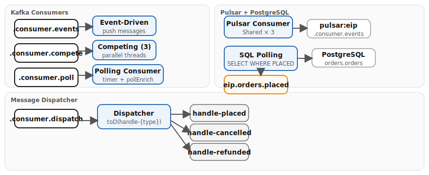

# Chapter 14: Consumer Patterns

Demonstrates six consumer strategies for pulling and receiving messages from Kafka, Pulsar, and PostgreSQL, ranging from on-demand polling to parallel competing consumers and content-based dispatch.

- **Polling Consumer** — Timer fires every 10s and uses `pollEnrich` to grab the next Kafka message on demand
- **SQL Polling Consumer** — Polls PostgreSQL every 30s for unprocessed rows, marks them as `PROCESSING`, and publishes to Kafka
- **Event-Driven Consumer** — Standard `from("kafka:...")` pushes messages into the route as they arrive
- **Pulsar Event-Driven Consumer** — Shared subscription with `numberOfConsumers=3` distributes messages across threads
- **Competing Consumers** — `consumersCount=3` creates three threads sharing partitions in the same consumer group
- **Message Dispatcher** — Single consumer dispatches to `direct:handle-{event_type}` routes via `toD()`

## Running

```bash
# From the repository root — start the infrastructure stack
./scripts/setup-stack.sh

# Start the example
cd examples/14-consumer-patterns && mvn quarkus:dev
```

## Infrastructure

Kafka, Pulsar, and PostgreSQL from the Podman stack (full stack minus Redis).

## Data flow



## What to observe

1. **Demo data generator** — orders appear every 3s in `eip.consumer.orders` with randomized `event_type` values (`order_placed`, `order_cancelled`, `order_refunded`)
2. **Event-driven consumer** — logs each message immediately as Kafka pushes it from `eip.consumer.events`
3. **Competing consumers** — three threads log messages from `eip.consumer.compete`; watch for different thread names processing in parallel
4. **Polling consumer** — every 10s the timer fires and `pollEnrich` grabs exactly one message from `eip.consumer.poll`; look for the gap between polls
5. **Message dispatcher** — logs show routing to `handle-order_placed`, `handle-order_cancelled`, or `handle-order_refunded` based on the `event_type` field
6. **Pulsar event-driven consumer** — shared subscription distributes messages across three consumer instances
7. **SQL polling consumer** — every 30s, demo rows are inserted into PostgreSQL; the SQL consumer picks up rows with `status = 'PLACED'`, marks them `PROCESSING`, and publishes to `eip.orders.placed`

## Kafka topics

| Topic | Description |
|---|---|
| `eip.consumer.orders` | Demo data generator output (orders every 3s) |
| `eip.consumer.poll` | Polling consumer source (`pollEnrich` grabs next message on demand, timer trigger every 10s) |
| `eip.consumer.events` | Event-driven consumer source (Kafka push) |
| `eip.consumer.compete` | Competing consumers source (`consumersCount=3`) |
| `eip.consumer.dispatch` | Message dispatcher source (dispatches to `handle-{event_type}`) |
| `eip.orders.placed` | SQL polling consumer output (rows from PostgreSQL published here) |

## Pulsar topics

| Topic | Description |
|---|---|
| `persistent://public/default/eip.consumer.events` | Shared subscription with `numberOfConsumers=3` |

## PostgreSQL tables

| Table | Description |
|---|---|
| `orders.orders` | Polled by SQL consumer (`WHERE status = 'PLACED'`), marks rows as `PROCESSING` via `onConsume` |

---

*Verification status: unverified.*
