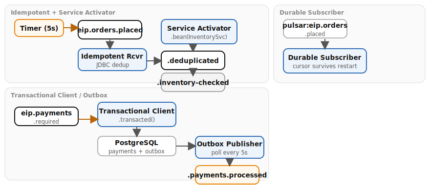

# Chapter 15: Endpoint Patterns

Demonstrates four endpoint-level patterns that handle deduplication, service invocation, durable subscriptions, and transactional reliability across Kafka, Pulsar, and PostgreSQL.

- **Idempotent Receiver (JDBC)** — `JdbcMessageIdRepository` backed by PostgreSQL deduplicates messages by `order_id` using jsonpath
- **Service Activator** — `.bean(InventoryService.class, "checkStock")` invokes a CDI-managed service bean from within a Camel route
- **Durable Subscriber (Pulsar)** — Pulsar subscription retains cursor state across consumer restarts
- **Transactional Client / Outbox Pattern** — `.transacted()` writes payment and outbox event atomically in one DB transaction; a separate route polls unpublished outbox rows and publishes to Kafka

## Running

```bash
# From the repository root — start the infrastructure stack
./scripts/setup-stack.sh

# Start the example
cd examples/15-endpoints && mvn quarkus:dev
```

## Infrastructure

Kafka, Pulsar, and PostgreSQL from the Podman stack (full stack minus Redis).

## Data flow



## What to observe

1. **Demo data generator** — every 5s an order is multicast to both `eip.orders.placed` and `eip.payments.required`
2. **Idempotent receiver** — duplicate `order_id` values are silently dropped; watch for "Duplicate detected" log entries and check the `camel_messageprocessed` table in PostgreSQL
3. **Service activator** — `InventoryService.checkStock()` enriches orders with stock availability; logs show the bean invocation and enriched output on `eip.orders.inventory-checked`
4. **Transactional client** — payment records and outbox events are written atomically; check the `payments.payments` and `payments.outbox` tables
5. **Outbox publisher** — polls `payments.outbox` every 5s for unpublished rows, publishes to `eip.payments.processed`, and marks rows as published
6. **Durable subscriber** — Pulsar subscription logs orders; restart the application and observe that the cursor resumes from where it left off with no message loss

## Kafka topics

| Topic | Description |
|---|---|
| `eip.orders.placed` | Incoming orders (may contain duplicates) |
| `eip.orders.deduplicated` | Orders after JDBC deduplication |
| `eip.orders.inventory-checked` | Orders enriched with stock info from Service Activator |
| `eip.payments.required` | Payment requests (input to transactional client) |
| `eip.payments.processed` | Processed payments (published from outbox) |

## Pulsar topics

| Topic | Description |
|---|---|
| `persistent://public/default/eip.orders.placed` | Durable subscriber with `subscriptionName=notification-service` |

## PostgreSQL tables

| Table | Description |
|---|---|
| `payments.payments` | Payment records (`order_id`, `amount`, `status`) |
| `payments.outbox` | Transactional outbox events (`event_id`, `event_type`, `aggregate_id`, `payload`, `published`, `created_at`) |
| `camel_messageprocessed` | JDBC idempotent repository dedup tracking (auto-created by `JdbcMessageIdRepository`) |

---

*Verification status: verified against Quarkus 3.36.3, Camel 4.20.0 on Podman (2026-07-11).*
