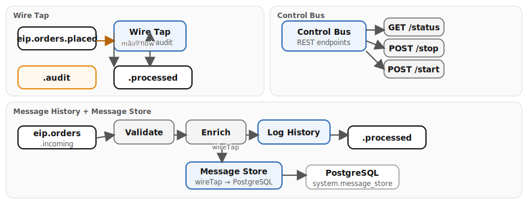

# Chapter 17: System Management

Demonstrates system management and observability patterns with Apache Camel on Quarkus. These patterns provide runtime visibility, auditing, and administrative control over running integration routes.

- **Control Bus** — exposes REST endpoints to start, stop, and query the status of routes at runtime via the `controlbus` component
- **Wire Tap** — taps order processing to send a copy of each message to an audit log topic without affecting the main flow
- **Message History** — enables message history tracking and logs the full route path each exchange has traversed
- **Message Store** — wire-taps messages flowing through the order pipeline and persists them to PostgreSQL (`system.message_store`) for auditing and debugging

## Running

```bash
# From the repository root
./scripts/setup-stack.sh

cd examples/17-observability && mvn quarkus:dev
```

## Infrastructure

Requires **Kafka** and **PostgreSQL** from the Podman stack.

## Data flow



## What to observe

1. Wire tap copies appearing on `eip.orders.audit` for every order processed through `eip.orders.placed`
2. Message history headers in the logs showing the full route path (e.g., `message-history-demo → history-validate → history-enrich → history-logger`)
3. Message store rows accumulating in the `system.message_store` PostgreSQL table
4. Control Bus REST responses reflecting the current status of managed routes
5. The main processing flow on `eip.orders.processed` remaining unaffected by wire tap and message store side-channels

## How to test

There is no demo data generator — messages must be produced manually to Kafka.

**Wire Tap** — produce an order to `eip.orders.placed` (via Kafka UI at [http://localhost:8090](http://localhost:8090)):

```json
{"order_id": 7001, "customer_id": "C-400", "item_sku": "SKU-WW", "quantity": 1, "amount": 59.99}
```

The order flows to `eip.orders.processed` and a copy appears on `eip.orders.audit`.

**Message History** — produce an order to `eip.orders.incoming`:

```json
{"order_id": 7002, "customer_id": "C-401", "item_sku": "SKU-HH", "quantity": 3, "amount": 99.99}
```

Watch the logs for the full route path (e.g., `message-history-demo → history-validate → history-enrich → history-logger`).

**Control Bus** — query and manage routes via REST:

```bash
curl http://localhost:8082/control/status/wiretap-order-processor
curl -X POST http://localhost:8082/control/stop/wiretap-order-processor
curl -X POST http://localhost:8082/control/start/wiretap-order-processor
```

## Kafka topics

| Topic | Description |
|-------|-------------|
| `eip.orders.placed` | Incoming orders for wire tap demo |
| `eip.orders.incoming` | Incoming orders for message history and message store demos |
| `eip.orders.processed` | Successfully processed orders (output from wire tap and message history) |
| `eip.orders.audit` | Audit log copies via wire tap |

## PostgreSQL tables

| Table | Columns |
|-------|---------|
| `system.message_store` | `message_id`, `route_id`, `timestamp`, `payload` |

---

*Verification status: verified against Quarkus 3.36.3, Camel 4.20.0 on Podman (2026-07-11).*
