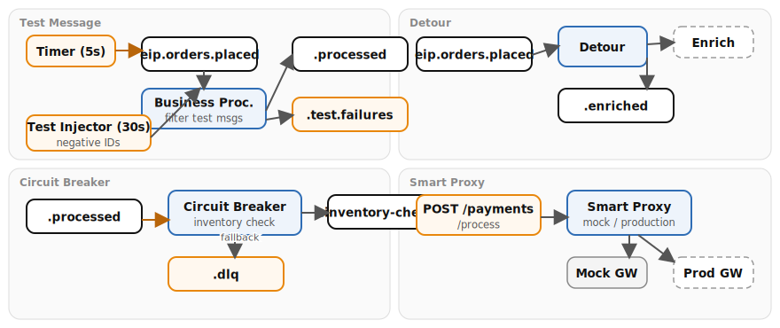

# Chapter 18: Testing and Management

Demonstrates four testing and management patterns with Apache Camel on Quarkus. These patterns validate message flows at runtime, control routing behavior through configuration, and protect against downstream failures.

- **Test Message** — injects synthetic test orders (negative IDs, `test_message=true` header) every 30 seconds; a verifier route checks processed output and logs pass/fail; the business route filters test messages before processing
- **Detour** — conditionally bypasses an enrichment step based on the `feature.enrichment.enabled` property
- **Smart Proxy** — routes payment requests to a mock or production gateway based on `payment.gateway.mode`
- **Circuit Breaker (Managed Channel Adapter)** — wraps an external inventory call in a `.circuitBreaker()`; when the service fails, the `.onFallback()` routes to a DLQ

## Running

```bash
# From the repository root
./scripts/setup-stack.sh

cd examples/18-testing-management && mvn quarkus:dev
```

## Infrastructure

Requires **Kafka** from the Podman stack.

## Data flow



## What to observe

1. Demo data generator producing a new order every 5 seconds to `eip.orders.placed`
2. Test message injector producing synthetic orders with negative IDs and `test_message=true` header every 30 seconds
3. Business processor filtering test messages away from `eip.orders.processed` and routing them to the verifier
4. Test message verifier checking `order_id < 0`, `amount == 99.99`, `customer == "TEST-ROBOT"` and logging PASS or FAIL
5. Detour routing orders through or around the enrichment step based on `feature.enrichment.enabled`
6. Circuit breaker opening after inventory check failures (every 3rd call fails) and routing to `eip.orders.dlq`
7. Smart Proxy forwarding payment requests to the mock gateway by default

## How to test

**Smart Proxy** — send a payment request (mock mode is the default):

```bash
curl -X POST http://localhost:8082/payments/process \
  -H "Content-Type: application/json" \
  -d '{"order_id": 42, "amount": 150.00}'
```

## Kafka topics

| Topic | Description |
|-------|-------------|
| `eip.orders.placed` | All incoming orders (demo data generator and test messages) |
| `eip.orders.processed` | Real orders after test message filtering |
| `eip.orders.enriched` | Orders after detour/enrichment step |
| `eip.orders.inventory-checked` | Orders that passed inventory check (circuit breaker) |
| `eip.orders.dlq` | Orders that failed circuit breaker (fallback) |
| `eip.test.failures` | Test messages that did not match expectations |

---

*Verification status: unverified.*
