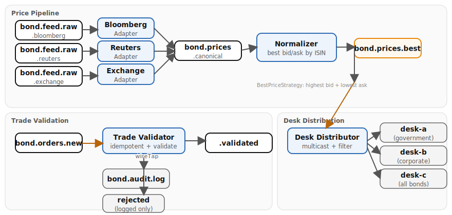

# Bond Trading Case Study (Appendix K)

Market Data Distribution implementation using Apache Camel. Raw price
feeds arrive from three market data sources (Bloomberg, Reuters, Exchange), each
with its own proprietary format. Channel Adapters normalize every feed into a
canonical price, a Normalizer aggregates the best composite bid/ask across sources
by ISIN, and a Content-Based Router multicasts filtered prices to trading desk
topics. A separate trade validation pipeline deduplicates and validates incoming
orders before forwarding them for execution. Both **Quarkus** and **Spring Boot** runtimes are provided — the Camel route logic is identical; only class annotations and configuration differ.

## Architecture



## Running

```bash
# Start the infrastructure stack (Kafka required)
./scripts/setup-stack.sh

# Quarkus
cd examples/bond-trading/quarkus
mvn quarkus:dev

# Spring Boot
cd examples/bond-trading/spring-boot
mvn spring-boot:run
```

## Infrastructure

Kafka (KRaft mode) only.

## How to test

There are no REST endpoints. The demo timers generate all data automatically:

- **Market data** every 2 seconds -- rotates through Bloomberg, Reuters, and Exchange sources with realistic bond prices around par (95--105, 5--20 bps spread)
- **Trade orders** every 10 seconds -- orderId (ORD-NNNNNN), portfolioId, ISIN, side (BUY/SELL), quantity, limitPrice, orderType (LIMIT/MARKET)

Watch the application logs to see prices flowing through the Channel Adapters,
Normalizer, and Desk Distributor pipeline. Trade orders appear in the validation
pipeline with duplicates rejected and valid orders forwarded.

The bond registry maps 10 identifiers (5 ISINs + 5 proprietary tickers) to 5
unique bonds:

- **Government:** US Treasury 10Y, German Bund 10Y, UK Gilt 10Y
- **Corporate:** JPMorgan Chase 5Y, Goldman Sachs 3Y

You can also inspect Kafka topics via the Kafka UI at <http://localhost:8090>.

## Kafka topics

| Topic                          | Description                                        |
|--------------------------------|----------------------------------------------------|
| `bond.feed.raw.bloomberg`      | Raw Bloomberg price updates                        |
| `bond.feed.raw.reuters`        | Raw Reuters price updates                          |
| `bond.feed.raw.exchange`       | Raw Exchange price updates                         |
| `bond.prices.canonical`        | Normalized canonical prices from all sources       |
| `bond.prices.best`             | Best composite bid/ask after aggregation by ISIN   |
| `bond.prices.filtered.desk-a`  | Government bonds for Desk A                        |
| `bond.prices.filtered.desk-b`  | Corporate bonds for Desk B                         |
| `bond.prices.filtered.desk-c`  | All bonds for Desk C                               |
| `bond.orders.new`              | Incoming trade orders                              |
| `bond.orders.validated`        | Orders that passed validation                      |
| `bond.audit.log`               | Audit trail of all orders (wire tap)               |

## Patterns demonstrated

1. **Channel Adapter** -- three adapters normalize Bloomberg (ISIN, decimal), Reuters (proprietary tickers, spread-adjusted), and Exchange (ISIN, fee-adjusted) formats to the canonical model
2. **Normalizer** -- BestPriceStrategy aggregation by ISIN with 500ms completion interval: highest bid + lowest ask across all sources
3. **Content-Based Router / Multicast** -- desk distributor multicasts to three desk filter routes in parallel
4. **Message Filter** -- Desk A filters government bonds, Desk B corporate bonds, Desk C passes all
5. **Idempotent Consumer** -- MemoryIdempotentRepository(200) deduplicates trade orders by orderId
6. **Wire Tap** -- trade validator wire-taps every order to bond.audit.log
7. **Message Translator** -- each channel adapter translates proprietary format to CanonicalPrice
8. **Aggregator** -- BestPriceStrategy selects best bid/ask across sources
9. **Pipes and Filters** -- raw feeds → adapters → normalizer → distributor → desk filters
10. **Message Channel** -- Kafka topics connect each processing stage
11. **Publish-Subscribe** -- desk distributor multicasts to all desks
12. **Point-to-Point** -- each raw feed topic has one adapter consumer
13. **Message Endpoint** -- each route is a consumer endpoint
14. **Datatype Channel** -- each desk topic carries a specific bond type
15. **Content Filter / Validator** -- validates trade orders (positive price, positive quantity)
16. **Dead Letter Channel** -- invalid trade orders are logged and dropped

---

*Verification status: Quarkus variant verified against Quarkus 3.37.0, Camel 4.20.0 on Podman (2026-07-11). Spring Boot variant compiles against Spring Boot 4.0.7, Camel 4.20.0.*
