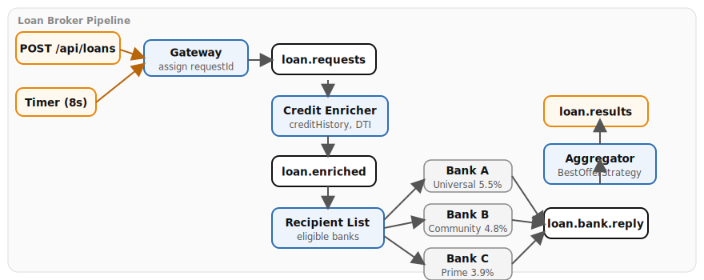

# Loan Broker Case Study (Appendix J)

Scatter-Gather implementation using Apache Camel on Quarkus. A loan request enters
via REST or a timer-generated demo, is enriched with credit bureau data, fanned out
to eligible banks via a Recipient List, and the best offer is selected by an
Aggregator that picks the lowest approved interest rate.

## Architecture



## Running

Start the infrastructure from the repository root:

```bash
./scripts/setup-stack.sh
```

Then run the Quarkus application in dev mode:

```bash
cd examples/loan-broker && mvn quarkus:dev
```

## Infrastructure

Kafka (KRaft mode) only.

## How to test

Submit a loan request:

```bash
curl -X POST http://localhost:8082/api/loans \
  -H "Content-Type: application/json" \
  -d '{
    "customerId": "CUST-042",
    "amount": 250000,
    "termMonths": 360,
    "creditScore": 740
  }'
```

Returns HTTP 202 with `{"status": "ACCEPTED", "requestId": "..."}`. Watch the
application logs to see credit enrichment, individual bank quotes, and best-offer
selection. The demo timer also generates a loan request every 8 seconds
automatically with random customers (CUST-NNN), amounts (50k--500k), and credit
scores (580--800).

Bank eligibility rules:

- **Bank A** (Universal Lender, base 5.5%) -- accepts all applicants
- **Bank B** (Community Credit Union, base 4.8%) -- creditScore >= 650 and amount <= 500k
- **Bank C** (Prime National, base 3.9%) -- creditScore >= 720

You can also inspect Kafka topics via the Kafka UI at <http://localhost:8090>.

## Kafka topics

| Topic              | Description                                                        |
|--------------------|--------------------------------------------------------------------|
| `loan.requests`    | Incoming loan requests                                             |
| `loan.enriched`    | Requests enriched with credit bureau data (creditHistory, debtToIncome) |
| `loan.bank.reply`  | Individual bank quote responses                                    |
| `loan.results`     | Best-offer result after aggregation                                |

## Patterns demonstrated

1. **Messaging Gateway** -- REST POST `/api/loans` accepts requests and publishes to Kafka
2. **Content Enricher** -- credit-enricher simulates credit bureau lookup, adds creditHistory years and debtToIncome ratio headers
3. **Recipient List** -- dynamically builds eligible bank list based on creditScore and amount thresholds
4. **Scatter-Gather** -- fans out to multiple banks in parallel and collects responses
5. **Aggregator** -- BestOfferStrategy picks the lowest interest rate among approved quotes (10s timeout)
6. **Content-Based Router** -- bank eligibility filtering by score and amount
7. **Pipes and Filters** -- sequential processing pipeline: gateway → enricher → scatter → aggregate
8. **Message Channel** -- Kafka topics connect each stage
9. **Message Endpoint** -- each route is a consumer endpoint
10. **Point-to-Point Channel** -- each bank gets its own request
11. **Request-Reply** -- banks respond with quotes
12. **Return Address** -- requestId header tracks the conversation
13. **Correlation Identifier** -- requestId correlates bank replies for aggregation

---

*Verification status: verified against Quarkus 3.36.3, Camel 4.20.0 on Podman (2026-07-11).*
